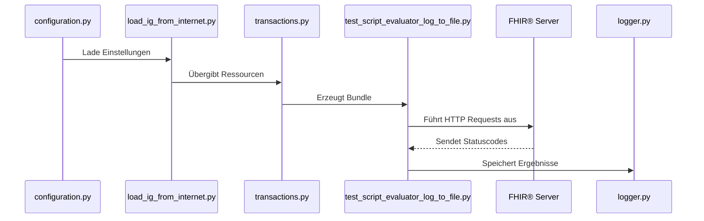

# TestFhiry Tester

Das Tool lädt automatisch zuvor definierte **TestScripts** herunter, führt sie gegen einen **FHIR®-Server** aus und dokumentiert die Ergebnisse.
Dadurch können Entwickler:innen frühzeitig Fehler erkennen und die **Konformität mit dem FHIR®-Standard** sicherstellen.

---
## Inhaltsverzeichnis

- [Einleitung](#einleitung)
- [Kernfunktionen](#kernfunktionen)
- [Verzeichnisstruktur](#verzeichnisstruktur)
- [Projektstatus](#projektstatus)
- [Funktionalitäten](#funktionalitäten)
- [Architekturüberblick](#architekturüberblick)
- [Codebase Overview](#codebase-overview)
- [Setup & Installation](#setup--installation)
- [Konfiguration](#konfiguration)
- [Ausführen](#ausführen)
- [Deployment](#deployment)
- [Troubleshooting](#troubleshooting)
- [Limitierungen](#limitierungen)
- [Roadmap](#roadmap)
- [Externe Quellen](#externe-quellen)

---
## Einleitung
### Zielsetzung

Das PythonTool soll eine **einheitliche, automatisierte Testumgebung** für FHIR®-Ressourcen bieten.
Konkret ermöglicht es:

* Automatisiertes Testen von FHIR®-Ressourcen
* Analyse und Export der Testergebnisse
* Frühzeitiges Erkennen von Fehlerquellen
* Wiederholbare und nachvollziehbare Testabläufe

### Aktuelle Funktionalität

- Fixtures werden automatisch erstellt
- Test-Action führt die definierte Operation aus
- Test-Assert validiert das Zielobjekt der Assertion
- Optionaler Testabbruch bei fehlgeschlagener Assertion
- Validierung anhand einer definierten Profil-ID
- Prüfung des erwarteten HTTP-Response-Codes

#### Speicherung der TestScripts

Alle **FHIR® TestScripts** aus den Leitfäden werden zentral gespeichert und automatisiert aktualisiert.

* **Speicherort**: Die Scripts werden als **JSON-Dateien** in folgendem Verzeichnis abgelegt:
    ```
    impl/testscripts/test_script_json_files
    ```

* **Automatisierte Aktualisierung**: Die Aktualisierung erfolgt über das Python-Skript:
    ```
    impl/testscripts/parse_testScripts_save_as_json.py
    ```

## Systemüberblick und Architektur

### Aufbau

```
.
├─ impl/
│  ├─ Example_Instances/        # Wird automatisch erstellt und enthält Example Instances
│  ├─ exception/               # Benutzerdefinierte Exceptions
│  ├─ ig_loader/               # Lädt IGs, Example Instances und Profile aus dem Internet
│  ├─ model/                   # Modelle für config.json und Fixtures
│  ├─ Profiles/                # Wird automatisch erstellt und enthält Profile
│  ├─ Results/                 # Wird automatisch erstellt und enthält Log-Dateien
│  ├─ test-script_evaluator/   # Dateien zur Evaluierung der Test-Scripts
│  ├─ Test_Scripts/            # Wird automatisch erstellt und enthält Test-Scripts
│  ├─ transactions/            # Dateien für FHIR® Transaction Bundles
│  ├─ config.json              # Konfiguration für die Ausführung
│  └─ requirements.txt         # Python-Abhängigkeiten

```
### Verzeichnis-Zweck
**Example_Instance/:** Wird automatisch erstellt. Enthält alle heruntergeladenen Example Instances.
**Profiles/:** Wird automatisch erstellt. Enthält alle geladenen Profile. 
**Test_Scripts/:** Wird automatisch erstellt. Enthält alle Test-Skripte.
**Results/:** Wird automatisch erstellt. Enthält die Log-Dateien der Ausführungen.
**exception/:** Enthält alle benutzerdefinierten Exceptions.
**ig_loader/:** Enthält das Skript load_ig_from_internet.py, das manuell ausgeführt werden muss, um die benötigten Ordner zu erstellen und Dateien aus dem Internet zu laden.
**model/:** Enthält alle Datenmodelle, z. B. für die Konfiguration und Fixtures.
**test-script_evaluator/:** Enthält alle Dateien, die für die Evaluierung der Test-Scripts benötigt werden.
**transactions/:** Enthält Dateien, die für die Erstellung von FHIR® Transaction Bundles benötigt werden.


### 4.2 Ablaufdiagramm


---

## 5. Funktionsweise

1. Konfiguration aus `config.json` wird geladen.
2. Das Tool lädt Implementation Guides (TestScripts & Example Instances).
3. Alle JSON-Ressourcen werden zu einem FHIR®-Bundle kombiniert.
4. Tests werden mit `pytest` ausgeführt (POST, GET, PUT).
5. Ergebnisse werden analysiert und als Logdatei exportiert.



---

## 6. Module im Detail


## 7. Bibliotheken

| Bibliothek              | Zweck                              |
| ----------------------- | ---------------------------------- |
| `requests`              | Kommunikation mit FHIR®-Server      |
| `pytest`                | Testautomatisierung                |
| `fpdf`                  | PDF-Export für Logfiles            |
| `beautifulsoup4`        | Parsing von Webseiteninhalten      |
| `json`, `os`, `pathlib` | Dateiverwaltung und Strukturierung |

---

## 8. Installation & Setup

### Voraussetzungen

* **Python >= 3.10**
* Internetverbindung (für `load_ig_from_internet.py`)
* Zugriff auf einen **FHIR®-kompatiblen Server**

### Installation

```bash
git clone https://github.com/.../TestFhiry.git
cd TestFhiry
pip install -r requirements.txt
python test_script_evaluator_log_to_file.py
```

---

## 9. Projektteam

* Julia Bodingbauer  
* Delaram Darehshoori  
* Magdalena Dorr  
* Alina Haider  
* Michael Bogensberger  
* Laura Ziebermayr


---

## 10. Kontakt

| Rolle | Name | E-Mail |
|-------|------|--------|
| **Projektbetreuung** | Anna Lin, M.Sc. | 📧 [Anna.Lin@fh-hagenberg.at](mailto:Anna.Lin@fh-hagenberg.at) |
| **Projektteam (Hauptkontakt)** | Laura Ziebermayr | 📧 [s2310458022@students.fh-hagenberg.at](mailto:s2310458022@students.fh-hagenberg.at) |


---


## 9. Geplante Erweiterungen

| Bereich                  | Beschreibung                                                    | Status            |
| ------------------------ | --------------------------------------------------------------- | ----------------- |
| `load_ig_from_folder.py` | Offline-Nutzung von lokalen IGs                                 | 🟡 in Entwicklung |

---

## 10. TestScript-Mapping

Die folgende Tabelle zeigt, welche Felder aus der FHIR®-TestScript-Ressource im PythonTool bereits umgesetzt sind oder noch geplant sind.

| Abschnitt       | Feld              | Beschreibung                        | Priorität | Implementiert |
| --------------- | ----------------- | ----------------------------------- | --------- | ------------- |
| Fixture         | autodelete        | Fixture wird beim Teardown gelöscht | hoch      | –             |
| Fixture         | autocreate        | Fixture wird beim Setup erstellt    | hoch      | –             |
| Setup–Action    | operation         | Führt definierte Operation aus      | –         | ✅             |
| Setup–Assert    | destination       | Zielobjekt der Assertion            | hoch      | ✅             |
| Setup–Assert    | stopTestOnFail    | Testabbruch bei Fehlschlag          | hoch      | –             |
| Setup–Assert    | validateProfileId | Profil-ID zur Validierung           | hoch      | –             |
| Setup–Assert    | responseCode      | Erwarteter HTTP-Code                | –         | ✅             |
| Setup–Assert    | warningOnly       | Nur Warnung bei Fehlschlag          | –         | ✅             |
| Teardown–Action | operation         | Aktion beim Teardown                | mittel    | –             |

