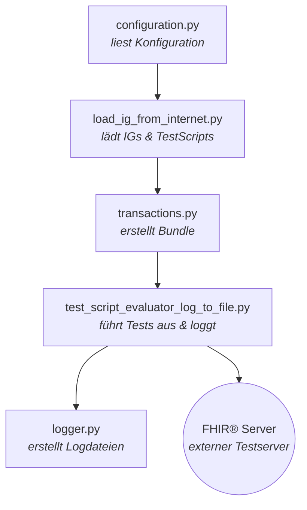

# TestFhiry Tester

Das Tool lädt automatisch zuvor definierte **TestScripts** herunter, führt sie gegen einen **FHIR®-Server** aus und dokumentiert die Ergebnisse.
Dadurch können Entwickler:innen frühzeitig Fehler erkennen und die **Konformität mit dem FHIR®-Standard** sicherstellen.

Dies ist ein Teil eines übergestellten Studienprojekts, der zweite Teil ist das Projekt [TestFhiry-TinkerTool](https://github.com/HL7Austria/HL7-AT-TestFhiry-TinkerTool)

---
## Inhaltsverzeichnis

- [TestFhiry Tester](#testfhiry-tester)
  - [Inhaltsverzeichnis](#inhaltsverzeichnis)
  - [Einleitung](#einleitung)
    - [Zielsetzung](#zielsetzung)
    - [Aktuelle Funktionalität](#aktuelle-funktionalität)
      - [Speicherung der TestScripts](#speicherung-der-testscripts)
  - [Systemüberblick und Architektur](#systemüberblick-und-architektur)
    - [Aufbau](#aufbau)
    - [Verzeichnis-Zweck](#verzeichnis-zweck)
    - [Ablaufdiagramm](#ablaufdiagramm)
  - [Funktionsweise](#funktionsweise)
  - [Bibliotheken](#bibliotheken)
  - [Codebase Overview](#codebase-overview)
    - [exception/](#exception)
    - [ig\_loader/](#ig_loader)
    - [model/](#model)
    - [test\_script\_evaluator/](#test_script_evaluator)
    - [transactions/](#transactions)
  - [Installation \& Setup](#installation--setup)
    - [Voraussetzungen](#voraussetzungen)
    - [Installation](#installation)
  - [Projektteam](#projektteam)
  - [TestScript-Mapping](#testscript-mapping)
  - [Potentielle Erweiterungen](#potentielle-erweiterungen)

---
## Einleitung
### Zielsetzung

Das PythonTool soll eine **einheitliche, automatisierte Testumgebung** für FHIR®-Ressourcen bieten.
Konkret ermöglicht es:

* Automatisiertes Testen von FHIR®-Ressourcen
* Analyse und Export der Testergebnisse
* Frühzeitiges Erkennen von Fehlerquellen
* Wiederholbare und nachvollziehbare Testabläufe

### Aktuelle Funktionalität

- Fixtures werden automatisch erstellt
- Test-Action führt die definierte Operation aus
- Test-Assert validiert das Zielobjekt der Assertion
- Optionaler Testabbruch bei fehlgeschlagener Assertion
- Validierung anhand einer definierten Profil-ID
- Prüfung des erwarteten HTTP-Response-Codes

#### Speicherung der TestScripts

Alle **FHIR® TestScripts** aus den Leitfäden werden zentral gespeichert und automatisiert aktualisiert.

* **Speicherort**: Die Scripts werden als **JSON-Dateien** in folgendem Verzeichnis abgelegt:
    ```
    impl/testscripts/test_script_json_files
    ```

* **Automatisierte Aktualisierung**: Die Aktualisierung erfolgt über das Python-Skript:
    ```
    impl/testscripts/parse_testScripts_save_as_json.py
    ```

## Systemüberblick und Architektur

### Aufbau

```
.
├─ impl/
│  ├─ Example_Instances/        # Wird automatisch erstellt und enthält Example Instances
│  ├─ exception/               # Benutzerdefinierte Exceptions
│  ├─ ig_loader/               # Lädt IGs, Example Instances und Profile aus dem Internet
│  ├─ model/                   # Modelle für config.json und Fixtures
│  ├─ Profiles/                # Wird automatisch erstellt und enthält Profile
│  ├─ Results/                 # Wird automatisch erstellt und enthält Log-Dateien
│  ├─ test-script_evaluator/   # Dateien zur Evaluierung der Test-Scripts
│  ├─ Test_Scripts/            # Wird automatisch erstellt und enthält Test-Scripts
│  ├─ transactions/            # Dateien für FHIR® Transaction Bundles
│  ├─ config.json              # Konfiguration für die Ausführung
│  └─ requirements.txt         # Python-Abhängigkeiten

```
### Verzeichnis-Zweck
**Example_Instance/:** Wird automatisch erstellt. Enthält alle heruntergeladenen Example Instances.


**Profiles/:** Wird automatisch erstellt. Enthält alle geladenen Profile. 


**Test_Scripts/:** Wird automatisch erstellt. Enthält alle Test-Skripte.


**Results/:** Wird automatisch erstellt. Enthält die Log-Dateien der Ausführungen.


**exception/:** Enthält alle benutzerdefinierten Exceptions.


**ig_loader/:** Enthält das Skript load_ig_from_internet.py, das manuell ausgeführt werden muss, um die benötigten Ordner zu erstellen und Dateien aus dem Internet zu laden.


**model/:** Enthält alle Datenmodelle, z. B. für die Konfiguration und Fixtures.


**test-script_evaluator/:** Enthält alle Dateien, die für die Evaluierung der Test-Scripts benötigt werden.


**transactions/:** Enthält Dateien, die für die Erstellung von FHIR® Transaction Bundles benötigt werden.


### Ablaufdiagramm


```mermaid
flowchart TD
    A[configuration.py<br/><i>liest Konfiguration</i>] --> B[load_ig_from_internet.py<br/><i>lädt IGs & TestScripts</i>]
    B --> C[transactions.py<br/><i>erstellt Bundle</i>]
    C --> D[test_script_evaluator_log_to_file.py<br/><i>führt Tests aus & loggt</i>]
    D --> E[logger.py<br/><i>erstellt Logdateien</i>]
    D --> F((FHIR® Server<br/><i>externer Testserver</i>))
```

---

## Autocreate Reference Resolution

Das Tool verfügt über ein automatisches Reference Resolution System für Fixtures mit `autocreate=true`. Dieses System stellt sicher, dass Fixtures in der korrekten Reihenfolge erstellt werden, damit Referenzen zwischen Fixtures korrekt aufgelöst werden können.

### Funktionsweise

1. **Referenz-Parsing**: Alle Fixtures werden nach Referenzen auf andere Fixtures gescannt (sowohl JSON als auch XML)
2. **Dependency Resolution**: Die Fixtures werden topologisch sortiert, um die korrekte Erstellungsreihenfolge zu bestimmen
3. **Sequentielle Erstellung**: Fixtures werden nacheinander erstellt, beginnend mit denen ohne Abhängigkeiten
4. **Referenz-Ersetzung**: Während der Erstellung werden lokale Fixture-Referenzen durch die tatsächlichen Server-IDs ersetzt

### Vorteile

- Keine zirkulären Abhängigkeiten werden toleriert (werden mit Fehler abgebrochen)
- Referenzen werden automatisch mit server-seitigen IDs aktualisiert
- Keine manuelle Anpassung von Referenzen erforderlich

### Voraussetzungen für TestScripts

Damit das Autocreate Reference Resolution System korrekt funktioniert, müssen TestScripts folgende Anforderungen erfüllen:

**WICHTIG**: Wenn ein Fixture mit `autocreate=true` auf eine Referenz verweist, muss diese Referenz ebenfalls als Fixture im TestScript definiert sein und `autocreate=true` haben.

**Beispiel:**
```json
{
  "fixture": [
    {
      "id": "patient-a",
      "autocreate": true,
      "resource": {
        "reference": "Patient/PatientExample"
      }
    },
    {
      "id": "patient-b",
      "autocreate": true,
      "resource": {
        "reference": "Patient/PatientWithReference"
      }
    }
  ]
}
```

Wenn `PatientWithReference` auf `PatientExample` verweist, muss `PatientExample` ebenfalls als Fixture mit `autocreate=true` definiert sein. Andernfalls schlägt die Erstellung fehl.

**Referenztypen:**
- `reference` Felder
- `contained` Ressourcen
- Verschachtelte Referenzen in beliebigen Pfaden (z.B. `Patient.link.other`)

**Fixtures in XML und JSON**
Die Verbindung zwischen einer Fixture-Referenz im TestScript und der entsprechenden Datei erfolgt über den **Basisnamen** (Dateiname ohne Extension).

**Beispiel:**
```json
{
  "fixture": [
    {
      "id": "patient-a",
      "resource": {
        "reference": "Patient-HL7ATCorePatientExample.html"
      }
    }
  ]
}
```

Das Tool sucht nach einer Datei mit dem Basisnamen `Patient-HL7ATCorePatientExample` im `Example_Instances/` Ordner

Wenn eine Fixture sowohl als XML- als auch als JSON-Datei existiert, müssen sie unterschiedliche Basisnamen haben, damit klar ist, welche verwendet wird. Die richtige Benutzung und Referenzierung innerhalb des TestScripts ist somit alleinige Verantwortung des Benutzers.

**Gleichnamige SourceIds**
Wenn zwei interne Ids (responseId, fixtureId) gleich benannt sind, wird der Ablauf des Programms gestoppt und das TestScript wird geskippt.

**Referenzen in Example Instances**
Die Referenzen innerhalb der Example Instances (z.B. in `link`-Feldern oder anderen `reference`-Feldern) funktionieren mit den IDs der Example Instances. 

**WICHTIG**: Damit das Autocreate Reference Resolution System korrekt erkennen kann, auf welche Fixture verwiesen wird, müssen die IDs innerhalb der heruntergeladenen Example Instances unterschiedlich sein. Jede Example Instance sollte eine eindeutige ID haben, um Konflikte bei der Dependency-Resolution zu vermeiden.

**Beispiel:**
- `Patient-HL7ATCorePatientExample01.json` hat `id: "HL7ATCorePatientExample01"`
- `Patient-HL7ATCorePatientExample02.json` hat `id: "HL7ATCorePatientExample02"`

Wenn zwei Example Instances die gleiche ID haben, kann das System nicht unterscheiden, auf welche verwiesen wird, was zu Fehlern bei der Dependency-Resolution führen kann.

---

## Funktionsweise

1. Konfiguration aus `config.json` wird geladen.
2. Das Tool lädt Implementation Guides (TestScripts & Example Instances).
3. Alle JSON-Ressourcen werden zu einem FHIR®-Bundle kombiniert.
4. Tests werden ausgeführt (POST, GET, PUT).
5. Ergebnisse werden analysiert und als Logdatei exportiert.


```mermaid
sequenceDiagram
    participant Config as configuration.py
    participant Loader as load_ig_from_internet.py
    participant Builder as transactions.py
    participant Evaluator as test_script_evaluator_log_to_file.py
    participant Server as FHIR® Server
    participant Log as logger.py

    Config->>Loader: Lade Einstellungen
    Loader->>Builder: Übergibt Ressourcen
    Builder->>Evaluator: Erzeugt Bundle
    Evaluator->>Server: Führt HTTP Requests aus
    Server-->>Evaluator: Sendet Statuscodes
    Evaluator->>Log: Speichert Ergebnisse
```
---

## Bibliotheken

| Bibliothek              | Zweck                              |
| ----------------------- | ---------------------------------- |
| `requests`              | Kommunikation mit FHIR®-Server      |
| `beautifulsoup4`        | Parsing von Webseiteninhalten      |
| `json`, `os`, `pathlib` | Dateiverwaltung und Strukturierung |

---
## Codebase Overview

### exception/

**Hauptdateien:**
- `TestExecutionError.py` → Eigene Exception für Testausführungsfehler. 

### ig_loader/

**Hauptdateien:**
- `load_ig_from_internet.py` → Lädt Example Instances, Profile und Test-Skripte aus dem Internet und speichert sie in den vorgesehenen Ordnern. 


### model/

**Hauptdateien:**
- `configuration.py` → Modell für das config.json-File. 
- `fixture.py` → Modell für die Fixtures. 

### test_script_evaluator/

**Hauptdateien:**
- `configuration_manager.py` → Lädt und verwaltet Konfigurationseinstellungen. 
- `logger.py` → Zuständig für das Logging in die Log-Dateien. 
- `profile_manager.py` → Speichert und verwaltet Profile. 
- `test_script_evaluator_log_to_file.py` → Hauptskript für die Evaluierung von Test-Scripts. 
- `utils.py` → Hilfsfunktionen, die mehrfach verwendet werden. 
- `validate.py` → Validierungen der Test-Scripts. 

### transactions/

**Hauptdateien:**
- `transactions.py` → Erstellt FHIR® Transaction Bundles zum Speichern von Fixtures. 


## Installation & Setup

### Voraussetzungen

* **Python >= 3.10**
* Internetverbindung (für `load_ig_from_internet.py`)
* Zugriff auf einen **FHIR®-kompatiblen Server**

### Installation

```bash
git clone https://github.com/.../TestFhiry.git
cd TestFhiry
pip install -r requirements.txt
cd impl/ig_loader
python load_ig_from_internet.py
cd ../..
python -m impl
```

---

## Projektteam

* Julia Bodingbauer  
* Delaram Darehshoori  
* Magdalena Dorr  
* Alina Haider  
* Michael Bogensberger  
* Laura Ziebermayr

---
## TestScript-Mapping

Die folgende Tabelle zeigt, welche Felder aus der FHIR®-TestScript-Ressource im PythonTool bereits umgesetzt sind oder noch geplant sind.

| Abschnitt       | Feld              | Beschreibung                        | Priorität | Implementiert |
| --------------- | ----------------- | ----------------------------------- | --------- | ------------- |
| Fixture         | autodelete        | Fixture wird beim Teardown gelöscht | hoch      | ✅             |
| Fixture         | autocreate        | Fixture wird beim Setup erstellt    | hoch      | ✅             |
| Setup–Action    | operation         | Aktion beim Setup      | –         | –             |
| Test–Action    | operation         | Führt definierte Operation aus      | –         | ✅             |
| Test–Assert    | destination       | Zielobjekt der Assertion            | hoch      | ✅             |
| Test–Assert    | stopTestOnFail    | Testabbruch bei Fehlschlag          | hoch      | ✅             |
| Test–Assert    | validateProfileId | Profil-ID zur Validierung           | hoch      | –             |
| Test–Assert    | responseCode      | Erwarteter HTTP-Code                | –         | ✅             |
| Test–Assert    | warningOnly       | Nur Warnung bei Fehlschlag          | –         | –             |
| Teardown–Action | operation         | Aktion beim Teardown                | mittel    | –             |

---
## Potentielle Erweiterungen

Hier werdend die möglichen bekannten Erweiterungen für dieses Projekt aufgelistet

- Teardown hinzufügen
- Setup hinzufügen
- standardisierte Formatierung bei der Ausgabe der Ergebnisse
- Client-Test unterstützung
- Unterschiede mit TestFhiry-TinkerTool abgleichen

Die dokumentierten Unterschiede zum TestFhiry-TinkerTool sind im UnterschiedeZuTinkerTool.md zu finden.
