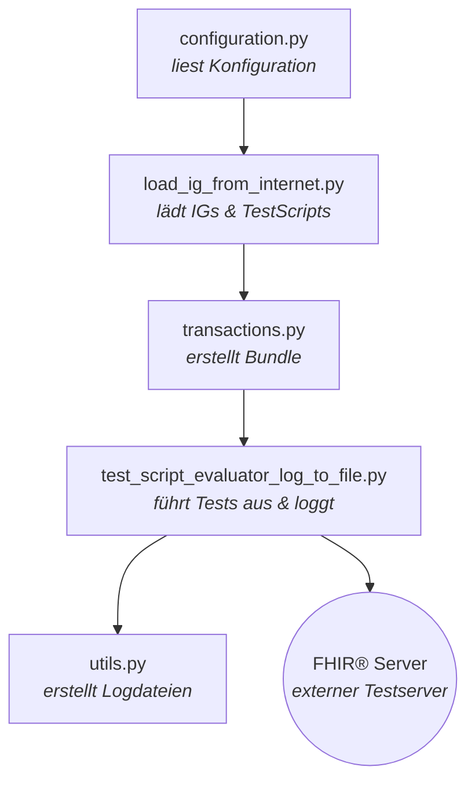
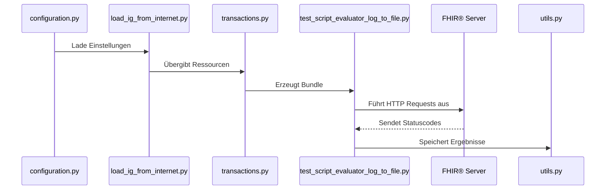

# TestFhiry Tester

Das Tool lädt automatisch zuvor definierte **TestScripts** herunter, führt sie gegen einen **FHIR®-Server** aus und dokumentiert die Ergebnisse.
Dadurch können Entwickler:innen frühzeitig Fehler erkennen und die **Konformität mit dem FHIR®-Standard** sicherstellen.

Dies ist ein Teil eines übergestellten Studienprojekts, der zweite Teil ist das Projekt [TestFhiry-TinkerTool](https://github.com/HL7Austria/HL7-AT-TestFhiry-TinkerTool)

---
## Inhaltsverzeichnis

- [TestFhiry Tester](#testfhiry-tester)
  - [Inhaltsverzeichnis](#inhaltsverzeichnis)
  - [Einleitung](#einleitung)
    - [Zielsetzung](#zielsetzung)
    - [Aktuelle Funktionalität](#aktuelle-funktionalität)
      - [Speicherung der TestScripts](#speicherung-der-testscripts)
  - [Systemüberblick und Architektur](#systemüberblick-und-architektur)
    - [Aufbau](#aufbau)
    - [Verzeichnis-Zweck](#verzeichnis-zweck)
    - [Ablaufdiagramm](#ablaufdiagramm)
  - [Funktionsweise](#funktionsweise)
  - [Bibliotheken](#bibliotheken)
  - [Codebase Overview](#codebase-overview)
    - [exception/](#exception)
    - [ig\_loader/](#ig_loader)
    - [model/](#model)
    - [test\_script\_evaluator/](#test_script_evaluator)
    - [transactions/](#transactions)
  - [Installation \& Setup](#installation--setup)
    - [Voraussetzungen](#voraussetzungen)
    - [Installation](#installation)
    - [Konfiguration](#konfiguration)
    - [Ausführung](#ausführung)
  - [Projektteam](#projektteam)
  - [TestScript-Mapping](#testscript-mapping)
  - [Potentielle Erweiterungen](#potentielle-erweiterungen)

---
## Einleitung
### Zielsetzung

Das PythonTool soll eine **einheitliche, automatisierte Testumgebung** für FHIR®-Ressourcen bieten.
Konkret ermöglicht es:

* Automatisiertes Testen von FHIR®-Ressourcen
* Analyse und Export der Testergebnisse
* Frühzeitiges Erkennen von Fehlerquellen
* Wiederholbare und nachvollziehbare Testabläufe

### Aktuelle Funktionalität

- Fixtures werden automatisch erstellt
- Test-Action führt die definierte Operation aus
- Test-Assert validiert das Zielobjekt der Assertion
- Optionaler Testabbruch bei fehlgeschlagener Assertion
- Validierung anhand einer definierten Profil-ID
- Prüfung des erwarteten HTTP-Response-Codes

#### Speicherung der TestScripts

Alle **FHIR® TestScripts** aus den Leitfäden werden zentral gespeichert und automatisiert aktualisiert.

* **Speicherort**: Die Scripts werden als **JSON-Dateien** in folgendem Verzeichnis abgelegt:
    ```
    impl/Test_Scripts/
    ```

* **Automatisierte Aktualisierung**: Die Aktualisierung erfolgt über das Python-Skript:
    ```
    impl/ig_loader/load_ig_from_internet.py
    ```

## Systemüberblick und Architektur

### Aufbau

```
.
├─ impl/
│  ├─ Example_Instances/        # Wird automatisch erstellt und enthält Example Instances
│  ├─ exception/               # Benutzerdefinierte Exceptions
│  ├─ ig_loader/               # Lädt IGs, Example Instances und Profile aus dem Internet
│  ├─ model/                   # Modelle für config.json, Fixtures, Interactions und Variables
│  ├─ Profiles/                # Wird automatisch erstellt und enthält Profile
│  ├─ Results/                 # Wird automatisch erstellt und enthält Log-Dateien
│  ├─ test_script_evaluator/   # Dateien zur Evaluierung der Test-Scripts
│  ├─ Test_Scripts/            # Wird automatisch erstellt und enthält Test-Scripts
│  ├─ transactions/            # Dateien für FHIR® Transaction Bundles
│  ├─ __init__.py              # Package-Initialisierung
│  ├─ __main__.py              # Einstiegspunkt für python -m impl
│  └─ config.json              # Konfiguration für die Ausführung
├─ requirements.txt            # Python-Abhängigkeiten

```
### Verzeichnis-Zweck
**Example_Instance/:** Wird automatisch erstellt. Enthält alle heruntergeladenen Example Instances.


**Profiles/:** Wird automatisch erstellt. Enthält alle geladenen Profile. 


**Test_Scripts/:** Wird automatisch erstellt. Enthält alle Test-Skripte.


**Results/:** Wird automatisch erstellt. Enthält die Log-Dateien der Ausführungen.


**exception/:** Enthält alle benutzerdefinierten Exceptions.


**ig_loader/:** Enthält das Skript load_ig_from_internet.py, das manuell ausgeführt werden muss, um die benötigten Ordner zu erstellen und Dateien aus dem Internet zu laden.


**model/:** Enthält alle Datenmodelle, z. B. für die Konfiguration und Fixtures.


**test_script_evaluator/:** Enthält alle Dateien, die für die Evaluierung der Test-Scripts benötigt werden.


**transactions/:** Enthält Dateien, die für die Erstellung von FHIR® Transaction Bundles benötigt werden.


### Ablaufdiagramm


```mermaid
flowchart TD
    A[configuration.py<br/><i>liest Konfiguration</i>] --> B[load_ig_from_internet.py<br/><i>lädt IGs & TestScripts</i>]
    B --> C[transactions.py<br/><i>erstellt Bundle</i>]
    C --> D[test_script_evaluator_log_to_file.py<br/><i>führt Tests aus & loggt</i>]
    D --> E[utils.py<br/><i>erstellt Logdateien</i>]
    D --> F((FHIR® Server<br/><i>externer Testserver</i>))
```

---

## Funktionsweise

1. Konfiguration aus `config.json` wird geladen.
2. Das Tool lädt Implementation Guides (TestScripts & Example Instances).
3. Alle JSON-Ressourcen werden zu einem FHIR®-Bundle kombiniert.
4. Tests werden ausgeführt (POST, GET, PUT).
5. Ergebnisse werden analysiert und als Logdatei exportiert.


```mermaid
sequenceDiagram
    participant Config as configuration.py
    participant Loader as load_ig_from_internet.py
    participant Builder as transactions.py
    participant Evaluator as test_script_evaluator_log_to_file.py
    participant Server as FHIR® Server
    participant Log as utils.py

    Config->>Loader: Lade Einstellungen
    Loader->>Builder: Übergibt Ressourcen
    Builder->>Evaluator: Erzeugt Bundle
    Evaluator->>Server: Führt HTTP Requests aus
    Server-->>Evaluator: Sendet Statuscodes
    Evaluator->>Log: Speichert Ergebnisse
```
---

## Bibliotheken

| Bibliothek              | Zweck                              |
| ----------------------- | ---------------------------------- |
| `requests`              | Kommunikation mit FHIR®-Server      |
| `beautifulsoup4`        | Parsing von Webseiteninhalten      |
| `fhirpathpy`            | Auswertung von FHIRPath-Ausdrücken |
| `jsonpath-ng`           | Auswertung von JSONPath-Ausdrücken |
| `lxml`                  | XML-Parsing und XPath-Auswertung   |
| `json`, `os`, `pathlib` | Dateiverwaltung und Strukturierung |

---
## Codebase Overview

### exception/

**Hauptdateien:**
- `Error.py` → Eigene Exceptions (`TestExecutionError`, `TestScriptError`, `OperationError`). 

### ig_loader/

**Hauptdateien:**
- `load_ig_from_internet.py` → Lädt Example Instances, Profile und Test-Skripte aus dem Internet und speichert sie in den vorgesehenen Ordnern. 


### model/

**Hauptdateien:**
- `configuration.py` → Modell für das config.json-File. 
- `fixture.py` → Modell für die Fixtures. 
- `interaction.py` → Modell für Server-Interaktionen (Request/Response). 
- `variable.py` → Modell für TestScript-Variablen. 

### test_script_evaluator/

**Hauptdateien:**
- `configuration_manager.py` → Lädt und verwaltet Konfigurationseinstellungen. 
- `test_script_evaluator_log_to_file.py` → Hauptskript für die Evaluierung von Test-Scripts. 
- `utils.py` → Hilfsfunktionen, die mehrfach verwendet werden. 
- `validate.py` → Validierungen der Test-Scripts. 
- `validator_cli.jar` → HL7 FHIR Validator CLI für Profil-Validierung. 

### transactions/

**Hauptdateien:**
- `transactions.py` → Erstellt FHIR® Transaction Bundles zum Speichern von Fixtures. 


## Installation & Setup

### Voraussetzungen

* **Python >= 3.10**
* Internetverbindung (für `load_ig_from_internet.py`)
* Zugriff auf einen **FHIR®-kompatiblen Server**

### Installation

```bash
git clone https://github.com/HL7Austria/HL7-AT-TestFhiry-TestRunner.git
cd HL7-AT-TestFhiry-TestRunner
pip install -r requirements.txt
```

### Konfiguration

Vor der Ausführung muss die Datei `impl/config.json` angepasst werden:

```json
{
  "url": "<URL des Implementation Guides>",
  "path": "<Absoluter Pfad zum impl-Verzeichnis>",
  "testscripts": ["<Pfade zu TestScript-Dateien>"],
  "fhirServer": "<URL des FHIR-Servers>"
}
```

Wenn `testscripts` leer gelassen wird (`[]`), werden automatisch alle `.json`-Dateien aus `impl/Test_Scripts/` verwendet.

### Ausführung

```bash
# 1. Implementation Guides, Example Instances, Profile und TestScripts herunterladen
python -m impl.ig_loader.load_ig_from_internet

# 2. Tests ausführen
python -m impl
```

Die Ergebnisse werden als Log-Datei unter `impl/Results/` gespeichert.

---

## Projektteam

* Julia Bodingbauer  
* Delaram Darehshoori  
* Magdalena Dorr  
* Alina Haider  
* Michael Bogensberger  
* Laura Ziebermayr

---
## TestScript-Mapping

Die folgende Tabelle zeigt, welche Felder aus der FHIR®-TestScript-Ressource im PythonTool bereits umgesetzt sind oder noch geplant sind.

| Abschnitt       | Feld                     | Beschreibung                                  | Implementiert |
| --------------- | ------------------------ | --------------------------------------------- | ------------- |
| Fixture         | autocreate               | Fixture wird beim Setup erstellt               | ✅             |
| Fixture         | autodelete               | Fixture wird beim Teardown gelöscht            | ✅             |
| Setup–Action    | operation                | Aktion beim Setup                              | ✅             |
| Test–Action     | operation                | Führt definierte Operation aus                 | ✅             |
| Teardown–Action | operation                | Aktion beim Teardown                           | ✅             |
| Test–Assert     | responseCode             | Erwarteter HTTP-Code                           | ✅             |
| Test–Assert     | response                 | Erwartete HTTP-Response (z.B. okay, created)   | ✅             |
| Test–Assert     | contentType              | Prüfung des Content-Type Headers               | ✅             |
| Test–Assert     | expression               | FHIRPath-Ausdruck zur Validierung              | ✅             |
| Test–Assert     | path                     | XPath/JSONPath-Ausdruck zur Validierung        | ✅             |
| Test–Assert     | headerField              | Prüfung eines HTTP-Header-Feldes               | ✅             |
| Test–Assert     | validateProfileId        | Profil-ID zur Validierung                      | ✅             |
| Test–Assert     | stopTestOnFail           | Testabbruch bei Fehlschlag                     | ✅             |
| Test–Assert     | compareToSourceId        | Vergleich mit einer anderen Fixture/Interaction | ✅             |
| Test–Assert     | operator                 | Vergleichsoperator (equals, in, contains, …)   | ✅             |
| Variable        | Variablenauflösung       | Ersetzung von `${varName}` in Operationen      | ✅             |
| Test–Assert     | resource                 | Prüfung des Ressourcentyps                     | ⚠️ (nur Operator-Check) |
| Test–Assert     | warningOnly              | Nur Warnung bei Fehlschlag                     | ❌             |
| Test–Assert     | navigationLinks          | Prüfung von Navigations-Links                  | ❌             |
| Test–Assert     | minimumId                | Minimaler Inhalt einer Ressource               | ❌             |
| Test–Assert     | defaultManualCompletion  | Manuelle Vervollständigung                     | ❌ (nicht unterstützt) |
| Test–Assert     | direction=request        | Assertions auf Requests                        | ❌ (out of scope) |

---
## Potentielle Erweiterungen

Hier werdend die möglichen bekannten Erweiterungen für dieses Projekt aufgelistet

- standardisierte Formatierung bei der Ausgabe der Ergebnisse
- Client-Test unterstützung
- Unterschiede mit TestFhiry-TinkerTool abgleichen

Die dokumentierten Unterschiede zum TestFhiry-TinkerTool sind im UnterschiedeZuTinkerTool.md zu finden.
