# TestFhiry – Projektdokumentation

## 0. Projektinterne Informationen
Branch-Namenskonvention: TicketNummer-KurzerText in CamelCase

Sprachkonventionen:
+ Alle Themen, die mit Programmierung zu tun haben, werden auf Englisch behandelt.
+ Alle Themen, die Git betreffen, werden auf Deutsch behandelt.

## Links zu Leitfäden
Links zu Leitfäden, auf die wir bereits Zugriff haben und die wir unterstützen. Auf einen Leitfaden haben wir derzeit noch keinen Zugriff:
+ https://fhir.hl7.at/
+ https://fhir.hl7.at/index_other.html

## Testscripts in Leitfaden:
+ https://fhir.hl7.at/r4-core-80-include-testscripts/tests.html

  
---
## 1. Einleitung

Das **PythonTool** ist Teil des Projekts **TestFhiry**, das im Rahmen eines Studienprojekt an der **Fachhochschule Oberösterreich** entwickelt wurde.
Ziel des Gesamtprojekts ist es, die **Testung und Zertifizierung von FHIR-basierten Softwarelösungen** im Gesundheitswesen zu unterstützen.

Das Tool lädt automatisch zuvor definierte **TestScripts** herunter, führt sie gegen einen **FHIR-Server** aus und dokumentiert die Ergebnisse.
Dadurch können Entwickler:innen frühzeitig Fehler erkennen und die **Konformität mit dem FHIR-Standard** sicherstellen.

---

## 2. Projektziele

Das PythonTool soll eine **einheitliche, automatisierte Testumgebung** für FHIR-Ressourcen bieten.
Konkret ermöglicht es:

* Automatisiertes Testen von FHIR-Ressourcen
* Analyse und Export der Testergebnisse
* Frühzeitiges Erkennen von Fehlerquellen
* Wiederholbare und nachvollziehbare Testabläufe

Zielgruppe sind **Softwareentwickler:innen** und **Qualitätsmanager:innen**, die FHIR-basierte Systeme entwickeln oder prüfen.

---
## 3. Projektorganisation:


#### 3.1 FHIR-Leitfäden

Die im Projekt verwendeten Implementation Guides (IGs) basieren auf den offiziellen Leitfäden von **HL7 Österreich**.

| Leitfaden | URL |
| :--- | :--- |
| **HL7 Austria FHIR Guide** | [https://fhir.hl7.at/](https://fhir.hl7.at/) |
| **Weitere Übersichten** | [https://fhir.hl7.at/index_other.html](https://fhir.hl7.at/index_other.html) |
| **TestScripts im Leitfaden** | [https://fhir.hl7.at/r4-core-80-include-testscripts/tests.html](https://fhir.hl7.at/r4-core-80-include-testscripts/tests.html) |

---

#### 3.2 Speicherung der TestScripts

Alle **FHIR TestScripts** aus den Leitfäden werden zentral gespeichert und automatisiert aktualisiert.

* **Speicherort**: Die Scripts werden als **JSON-Dateien** in folgendem Verzeichnis abgelegt:
    ```
    impl/testscripts/test_script_json_files
    ```

* **Automatisierte Aktualisierung**: Die Aktualisierung erfolgt über das Python-Skript:
    ```
    impl/testscripts/parse_testScripts_save_as_json.py
    ```

## 4. Systemüberblick und Architektur

### 4.1 Aufbau

Das Tool ist **modular aufgebaut** und besteht aus mehreren Python-Dateien, die klar getrennte Aufgaben übernehmen:

| Datei                                  | Aufgabe                                                                                            |
| -------------------------------------- | -------------------------------------------------------------------------------------------------- |
| `configuration.py`                     | Lädt zentrale Einstellungen (z. B. FHIR-Server, Log-Format) aus einer Konfigurationsdatei.         |
| `load_ig_from_internet.py`             | Lädt Implementation Guides (IGs), Example Instances und TestScripts aus dem Internet.              |
| `transactions.py`                      | Erstellt FHIR-konforme Transaction Bundles und achtet auf die korrekte Reihenfolge der Ressourcen. |
| `test_script_evaluator.py`             | Führt TestScripts aus (Basisversion, ohne Logging).                                                |
| `test_script_evaluator_log_to_file.py` | Erweiterte Version mit Logging und Dateiausgabe.                                                   |
| `logger.py`                            | Erstellt Logdateien in `.txt`, `.html` oder `.pdf`.                                                |
| `load_ig_from_folder.py`               | Option für Offline-Tests – liest IGs aus lokalen Ordnern.                                          |

### 4.2 Ablaufdiagramm

```mermaid
flowchart TD
    A[configuration.py<br/><i>liest Konfiguration</i>] --> B[load_ig_from_internet.py<br/><i>lädt IGs & TestScripts</i>]
    B --> C[transactions.py<br/><i>erstellt Bundle</i>]
    C --> D[test_script_evaluator_log_to_file.py<br/><i>führt Tests aus & loggt</i>]
    D --> E[logger.py<br/><i>erstellt Logdateien</i>]
    D --> F((FHIR Server<br/><i>externer Testserver</i>))
```



---

## 5. Funktionsweise

1. Konfiguration aus `config.json` wird geladen.
2. Das Tool lädt Implementation Guides (TestScripts & Example Instances).
3. Alle JSON-Ressourcen werden zu einem FHIR-Bundle kombiniert.
4. Tests werden mit `pytest` ausgeführt (POST, GET, PUT).
5. Ergebnisse werden analysiert und als Logdatei exportiert.

```mermaid
sequenceDiagram
    participant Config as configuration.py
    participant Loader as load_ig_from_internet.py
    participant Builder as transactions.py
    participant Evaluator as test_script_evaluator_log_to_file.py
    participant Server as FHIR Server
    participant Log as logger.py

    Config->>Loader: Lade Einstellungen
    Loader->>Builder: Übergibt Ressourcen
    Builder->>Evaluator: Erzeugt Bundle
    Evaluator->>Server: Führt HTTP Requests aus
    Server-->>Evaluator: Sendet Statuscodes
    Evaluator->>Log: Speichert Ergebnisse
```



---

## 6. Module im Detail

### 6.1 configuration.py

Lädt zentrale Konfigurationsdaten (z. B. Server-URL, Log-Format) aus `config.json`.

**Beispiel:**

```json
{
  "server": "http://cql-sandbox.projekte.fh-hagenberg.at:8080/fhir",
  "url": "https://hl7.org/fhir/at-core-r5",
  "log_format": "txt"
}
```

---

### 6.2 load_ig_from_internet.py

Lädt **Implementation Guides** (IGs) und **TestScripts** automatisch von einer Website herunter.
Verwendet `BeautifulSoup4` zum Durchsuchen der HTML-Struktur (`artifacts.html`) und speichert Dateien lokal.

---

### 6.3 transactions.py

Erstellt ein **FHIR-Transaction-Bundle**, das mehrere Ressourcen in der richtigen Reihenfolge enthält.
Dies ist wichtig, da referenzierte Ressourcen bereits existieren müssen.

**Beispiel:**

```json
{
  "resourceType": "Bundle",
  "type": "transaction",
  "entry": [ ... ]
}
```

---

### 6.4 test_script_evaluator_log_to_file.py

Kernmodul des Tools. Führt die TestScripts aus und protokolliert Ergebnisse mit `pytest`.

**Aufgaben:**

* Liest TestScripts ein
* Führt FHIR-Operationen (POST, GET, PUT) aus
* Validiert Serverantworten
* Erstellt detaillierte Logdateien

**Beispielausgabe:**

```
FHIR Test Log - 2025-10-20 21:15
Test: Patient Create
Executing: CREATE http://.../Patient
Response: 201
Verifying created resource via GET
Response: 200
PASSED
```

---

### 6.5 logger.py

Speichert Testergebnisse als `.txt`, `.html` oder `.pdf`.
Verwendet `fpdf` für den PDF-Export.

---

### 6.6 load_ig_from_folder.py

Alternative zu Online-Downloads – liest Implementation Guides aus lokalen Ordnern.
Ideal für Offline-Tests oder reproduzierbare Szenarien.

---

## 7. Bibliotheken

| Bibliothek              | Zweck                              |
| ----------------------- | ---------------------------------- |
| `requests`              | Kommunikation mit FHIR-Server      |
| `pytest`                | Testautomatisierung                |
| `fpdf`                  | PDF-Export für Logfiles            |
| `beautifulsoup4`        | Parsing von Webseiteninhalten      |
| `json`, `os`, `pathlib` | Dateiverwaltung und Strukturierung |

---

## 8. Installation & Setup

### Voraussetzungen

* **Python >= 3.10**
* Internetverbindung (für `load_ig_from_internet.py`)
* Zugriff auf einen **FHIR-kompatiblen Server**

### Installation

```bash
git clone https://github.com/.../TestFhiry.git
cd TestFhiry
pip install -r requirements.txt
python test_script_evaluator_log_to_file.py
```

---

## 9. Projektteam

* Julia Bodingbauer  
* Delaram Darehshoori  
* Magdalena Dorr  
* Alina Haider  
* Michael Bogensberger  
* Laura Ziebermayr


---

## 10. Kontakt

| Rolle | Name | E-Mail |
|-------|------|--------|
| **Projektbetreuung** | Assistenzprofessorin Dr. Anna Lin | 📧 [Anna.Lin@fh-hagenberg.at](mailto:Anna.Lin@fh-hagenberg.at) |
| **Projektteam (Hauptkontakt)** | Laura Ziebermayr | 📧 [s2310458022@students.fh-hagenberg.at](mailto:s2310458022@students.fh-hagenberg.at) |


---


## 9. Geplante Erweiterungen

| Bereich                  | Beschreibung                                                    | Status            |
| ------------------------ | --------------------------------------------------------------- | ----------------- |
| `load_ig_from_folder.py` | Offline-Nutzung von lokalen IGs                                 | 🟡 in Entwicklung |

---

## 10. TestScript-Mapping

Die folgende Tabelle zeigt, welche Felder aus der FHIR-TestScript-Ressource im PythonTool bereits umgesetzt sind oder noch geplant sind.

| Abschnitt       | Feld              | Beschreibung                        | Priorität | Implementiert |
| --------------- | ----------------- | ----------------------------------- | --------- | ------------- |
| Fixture         | autodelete        | Fixture wird beim Teardown gelöscht | hoch      | –             |
| Fixture         | autocreate        | Fixture wird beim Setup erstellt    | hoch      | –             |
| Setup–Action    | operation         | Führt definierte Operation aus      | –         | ✅             |
| Setup–Assert    | destination       | Zielobjekt der Assertion            | hoch      | ✅             |
| Setup–Assert    | stopTestOnFail    | Testabbruch bei Fehlschlag          | hoch      | –             |
| Setup–Assert    | validateProfileId | Profil-ID zur Validierung           | hoch      | –             |
| Setup–Assert    | responseCode      | Erwarteter HTTP-Code                | –         | ✅             |
| Setup–Assert    | warningOnly       | Nur Warnung bei Fehlschlag          | –         | ✅             |
| Teardown–Action | operation         | Aktion beim Teardown                | mittel    | –             |

